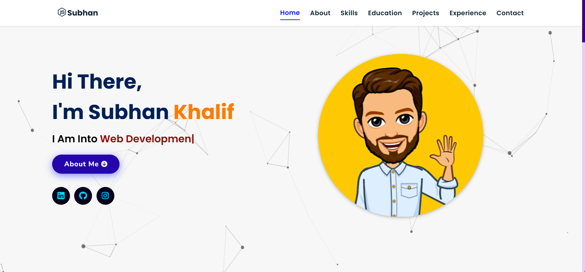
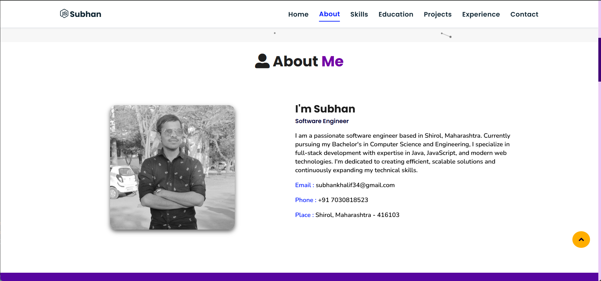

# 🚀 Portfolio Website – Subhan Khalif

A fully responsive personal **Portfolio Website** built using **HTML5**, **CSS3**, **JavaScript**, and **jQuery**.  
Showcasing my projects, skills, resume, and contact links in a sleek and interactive manner.

🌐 **[Visit Live Website »](https://subhan-khalif-portfolio.vercel.app/)**

---

## 🛠 Tech Stack

[](#)
[](#)
[](#)


### ✨ Additional Libraries

- **Particle.js** – for interactive background particles
- **Typed.js** – for typing animation effects
- **Tilt.js** – for tilt-on-hover 3D effect
- **ScrollReveal.js** – for scroll animations
- **Tawk.to** – for live chat support
- **Font Awesome** – for icons
- **JSON** – for structured data

---

## 📸 Sneak Peek

| Landing Page | About Section |
|--------------|----------------|
|  |  |

---

## 📬 Contact Me

Feel free to reach out to me via the following platforms:

[](https://www.linkedin.com/in/subhan-khalif)
[](https://www.instagram.com/subhan.khalif)

---

## 📁 Clone & Run Locally

```bash
git clone https://github.com/SubhanKhalif/portfolio-subhan.git
cd portfolio-subhan
open index.html
